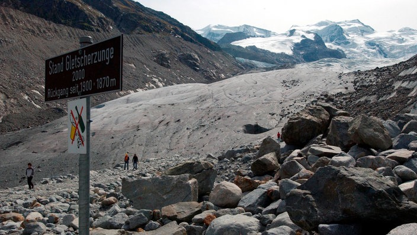

# Inhaltsverzeichnis
1. [Gletscher Allgemein](# Gletscher Allgemein)
2. [Die Anden](# Gletscherschmelze in den Anden)
3. [Die Alpen](# Die Alpen)
4. [Die Globalen Auswirkungungen](#Die Auswirkungen)
5. [Was kann man dagegen tun!](#Dagegen tun)

# Gletscher Allgemein

# Be­griff­lich­keiten und Fakten

## Ablation Sublimation
* Ablation: Abschmelzen von Eis.
* Sublimation: Gefrorenes Wasser geht direkt in Gasform.

## Der Meerespiegel und Klimawandel
> Schmelzene Gletscher haben keinen direktion Einfluss auf den Meerespiegel.

* Das Eis auf den Gletschern reflektiert das Sonnenlicht.
* Das Abschmelzen der Gletscher ver­än­dern aber die Meeresströmung.

# Der Aufbau

# Gletscherschmelze in den Anden

# Allgemeines ueber die Anden

# Gletscher in den Anden

## Einteilung der Gletscher
1. Tropischen Anden
2. Mittleren Anden
3. Patagonien Eisfelder

## Fakten
* Der Großteil der Gletscher befindet sich im südlichen Teil der Anden.
* Jedoch befinden sich in den tropischen Anden 99% der tropischen Gletscher weltweit.

# Aufbau der Anden-Gletschet

# Gletscherschmelze und Klimawandel

## Fakten
* Die Gletscher schmelzen immer schneller
* Es schmilzt mehr Eis und es bildet sich weniger Neues Eis
* Durch die Sublimation verdunstet Wasser außerdem in die Luft
* Tropische Gletscher reagieren schneller auf Temperaturveränderungen
* Kleine Gletscher sind schon vollständig geschmolzen

# Probleme für die Einwohner

## Menschen
* Hohe Bevölkerungsquote
* Gletscher versorgen die Menschen mit Wasser (Schmelzwasser)
* Bauern können keine Landwirtschaft mehr betreiben
* Auch die Großstädte leiden unter dem Wassermangel

# Die Alpen

# Alpen

## Allgemein
* Es gibt rund 500 Gletscher in den Alpen
* Erstrecken sich 1200 von Schweiz bis nach Frankreich
* Der Aletengletscher ist der der größte und längste Gletscher der Alpen (länge: 25km, Fläche 86,6km²)

## Daten
* Nich alle Gletscher reagieren gleich auf den Klimawandel
* Nach Berechnungen bis 21. Jahrhundert 3-4.5°C wärmer.
* Der gefrorene Boden wird zunehmend Instabil da Schmelzen.

# Bildvergleich

# Globale Auswirkung

# Die Auswirkungen

## Allgemein
* Gletscher werden zu Gesteinswüsten
* Der Lebensraum der Tiere wird zerstört
* Wassermangel für Bäche, Seen und Flüsse
* Wasserreserven verschwinden
* Eine Halbe Milliarde Menschen weltweit könnten durch den Anstieg des Meeres überflutet werden

## Andere
* Der Meeresspiegel wird steigen und durch die überschwemmte Städte werden Millionen von Umweltflüchtlingen entstehen.
* Eins mächtige Flüsse werden austrocken
* Die Zirkulation der Erde gerät im Ungleichgewicht
* Was dazu führt, dass drastische Klima Veränderung entstehen

# Gesteinswüste

# Antarktis-Arktis

# Vergleich Der Pole

## *Wie Lange existieren sie noch?*
* Arktis: 2040
* Antarktis: 2070

## Der Meerespiegel
*Wenn Beide Schmelzen: 66 Meter*

## Größe
* Die Arktis ist 20mio Quadratkilometer groß.
* Die Antarktis ist 21,2mio Quadratkilometer groß.

# Klima
**Beiden haben nur 1/2 Jahr Sonne**

### Arktis:
  * 15 bis -20 Grad
  * Heftige Schneestürme
  * 4.1 Prozent geschrumpft.

### Antarktis:
  * -35 bis -40 Grad
  * Hohe Windgeschwindigkeiten
  * 1.2 - 1.8 Prozent gewachsen.

*Stand der Beobachtungen von 1979 bis 2012*

# Tiere und Menschen

## Menschen
> **Es leben nur Forscher auf der  Antarktis. 4 Mil. Ureinwohner auf der Arktis.**

## Tiere
> **Auf der Arktis und/oder auf Antarktis leben:**

 Pinguine,
 Eisbaeren,
 Gänse,
 Insekten,
 Wale,
 Rentiere,

## Folgen wenn Weg:
* Jagdgebiert und Lebensraum der Menschen weg.
* Eisbären und anderen wird es zu warm und sterben ab.

# Was kann man dagegen tun?

# Was tun!

## Selber was machen
* Erneubare Engerien Nutzten
* Weniger mit Flugzeug fliegen
* Weniger Strom verbrauchen
* Fahrad Fahren

## UN-Klimakonferenz
> Eine Versammlung vieler Länder wo Ziele besprochen werden, die für das Aufhalten oder verlangsamen des Treibhauseffekts da sind       

* China hat viel Erneubare Energie
* Deutschland nutzt 36 % erneubare Energie.
und hat sich vorgenommen bis 2045/2050 es auf 45/50% aufzubessern.

## Eigenartige Lösongen
- Eine Mauer Drumherum zu bauen

- Sowie Eine künstliche Insel zu errichten die den Gletscher.

# Quellen
* https://de.wikipedia.org/wiki/Gletscher
* Axel Bojanowski: Geologen entdecken Graben von Ostsee-Sintflu
* klimafakten.de (2012): Auch wenn es einige wachsende Gletscher gibt, zeigt eine Gesamtschau, dass die Gletscher weltweit deutlich schrumpfen
* Stefan Winkler: Gletscher und ihre Landschaften. Eine illustrierte Einführung. Primus-Verlag, Darmstadt 2009, ISBN 978-3-89678-649-4.
* Pfeifer, Etymologisches Wörterbuch
* Duden.de: Gletscher
*  August von Böhm: Das oder der Kees? In: Mitteilungen des Deutschen und Österreichischen Alpenvereins, Jahrgang 1911
